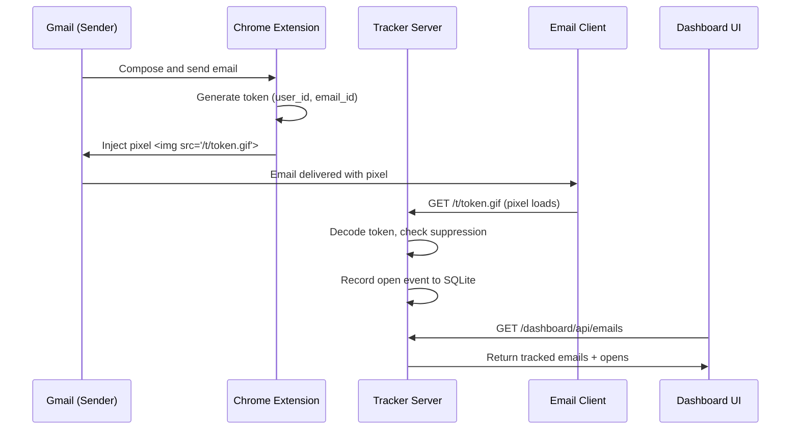

## Architecture overview

Email Tracker uses a client-server architecture where the Chrome extension injects tracking pixels and the Node.js server records open events.



## Component responsibilities

### Chrome extension

The extension has three main parts:

**Content script** (`extension/src/content/gmailCompose.js:161-315`)
- Detects Gmail compose dialogs using MutationObserver
- Extracts recipient and sender email from compose UI
- Requests tracking data from background worker
- Injects 1x1 transparent pixel into message body
- Renders inbox badges showing open counts
- Scans thread images for sender suppression

**Background service worker** (`extension/src/background/serviceWorker.js`)
- Generates stable `user_id` (stored in chrome.storage)
- Creates unique `email_id` (UUID) for each message
- Encodes tracking token with email metadata
- Fetches dashboard data and caches results
- Sends `POST /mark-suppress-next` signals

**Popup UI** (`extension/src/popup/*`)
- Configuration interface for tracker URL and dashboard token
- Debug view showing recent tracked emails
- Quick links to dashboard

### Node.js server

The server is an Express application with the following structure:

**Main application** (`server/src/index.ts:1-24`)
```typescript
import express from "express";
import { initDb } from "./db/sqlite.js";
import { dashboardRouter } from "./routes/dashboard.js";
import { trackRouter } from "./routes/track.js";

const app = express();
const port = Number(process.env.PORT ?? 8080);

app.set("trust proxy", true);
app.use(express.json({ limit: "16kb" }));
initDb();

app.get("/health", (_req, res) => {
  res.json({ ok: true });
});

app.use(dashboardRouter);
app.use(trackRouter);

app.listen(port, () => {
  console.log(`Tracker server listening on :${port}`);
});
```

**Tracking routes** (`server/src/routes/track.ts`)
- `GET /t/:token.gif` - Serves transparent pixel and records open
- `POST /mark-suppress-next` - Receives sender suppression signals
- `GET /metrics/gmail-proxy-latency` - Returns latency statistics
- `GET /metrics/suppress-signals` - Debug endpoint for suppression events

**Dashboard routes** (`server/src/routes/dashboard.ts`)
- `GET /dashboard` - Serves dashboard HTML UI
- `GET /dashboard/api/emails` - Returns tracked emails with open counts
- `GET /dashboard/api/open-events` - Returns detailed open event history
- All dashboard APIs require `X-Tracker-Token` header matching `DASHBOARD_TOKEN`

### SQLite database

The database uses two main tables:

**tracked_emails** (`server/src/db/schema.sql:3-11`)
```sql
CREATE TABLE IF NOT EXISTS tracked_emails (
  email_id TEXT PRIMARY KEY,
  user_id TEXT NOT NULL,
  recipient TEXT NOT NULL,
  sender_email TEXT,
  sent_at TEXT NOT NULL,
  open_count INTEGER NOT NULL DEFAULT 0,
  created_at TEXT NOT NULL DEFAULT (datetime('now'))
);
```

**open_events** (`server/src/db/schema.sql:13-31`)
```sql
CREATE TABLE IF NOT EXISTS open_events (
  id INTEGER PRIMARY KEY AUTOINCREMENT,
  email_id TEXT NOT NULL,
  user_id TEXT NOT NULL,
  recipient TEXT NOT NULL,
  opened_at TEXT NOT NULL DEFAULT (datetime('now')),
  ip_address TEXT,
  user_agent TEXT,
  geo_country TEXT,
  geo_region TEXT,
  geo_city TEXT,
  latitude REAL,
  longitude REAL,
  device_type TEXT NOT NULL DEFAULT 'other',
  is_duplicate INTEGER NOT NULL DEFAULT 0,
  is_sender_suppressed INTEGER NOT NULL DEFAULT 0,
  suppression_reason TEXT,
  FOREIGN KEY (email_id) REFERENCES tracked_emails(email_id)
);
```

<Note>
  Open events are always recorded, even if marked as duplicate or sender-suppressed. The `open_count` only increments for non-duplicate, non-suppressed opens.
</Note>

## End-to-end lifecycle

Here's the complete flow from installation to analytics:

### 1. Install and configure

- Operator installs dependencies and builds workspaces:
  ```bash
  npm install
  npm --workspace=shared run build
  npm --workspace=server run build
  ```
- Operator starts server with environment variables:
  ```bash
  PORT=8090 DASHBOARD_TOKEN=secret npm --workspace=server run start
  ```
- Operator loads extension in Chrome and configures popup with tracker URL and token

### 2. Sender composes and sends

- Gmail content script detects compose dialogs using `document.querySelectorAll('div[role="dialog"]')`
- On send intent (click, keyboard shortcut), content script extracts recipient and sender
- Content script sends message to background worker:
  ```javascript
  const response = await chrome.runtime.sendMessage({
    type: "tracker:getComposeTrackingData",
    recipient,
    senderEmail
  });
  ```
- Background worker generates token and returns pixel URL
- Content script injects hidden pixel (`extension/src/content/gmailCompose.js:280-286`):
  ```javascript
  const img = document.createElement("img");
  img.src = response.pixelUrl;  // https://your-domain/t/token.gif
  img.width = 1;
  img.height = 1;
  img.alt = "";
  img.style.cssText = "width:1px;height:1px;opacity:0;display:block;border:0;";
  body.appendChild(img);
  ```

### 3. Message arrives in recipient mailbox

- Recipient's email client renders the HTML message
- When pixel URL is in viewport (or pre-fetched), client makes `GET /t/token.gif` request
- Some clients (Gmail, Outlook) use image proxy servers that pre-fetch images

### 4. Server processes pixel request

**Token decoding** (`server/src/routes/track.ts:99`)
```typescript
const payload = decodeTrackingToken(token);
const ipAddress = getRequestIp(req);
const userAgent = req.get("user-agent") || null;
const emailId = payload.email_id;
```

**Suppression check** (`server/src/routes/track.ts:106-120`)
```typescript
const pendingSuppression = suppressionMap.get(emailId);
const wasSuppressedBySignal = Boolean(pendingSuppression);

if (pendingSuppression) {
  suppressionMap.delete(emailId);  // consume-once semantics
  pushSuppressionDebugEvent({
    event: "suppression_consumed",
    email_id: emailId,
    at_ms: nowMs,
    delta_ms: nowMs - pendingSuppression.createdAtMs
  });
}
```

**Open event recording** (`server/src/routes/track.ts:153-160`)
```typescript
const result = recordOpenEvent({
  payload,
  ipAddress,
  userAgent,
  openedAtIso,
  forceSenderSuppressed: wasSuppressedBySignal,
  suppressionReason: wasSuppressedBySignal ? "mark_suppress_next" : null
});
```

**Deduplication logic** (`src/services/openRecorder.ts`)
- Queries `open_events` for recent opens with same `email_id`, `ip_address`, and `user_agent`
- If found within `DEDUP_WINDOW_MS` (default 30 seconds), marks as duplicate
- Duplicate events don't increment `tracked_emails.open_count`
- All events are stored in `open_events` table with flags

**Response** (`server/src/routes/track.ts:171-177`)
```typescript
res.setHeader("Cache-Control", "no-store, no-cache, must-revalidate");
res.setHeader("Content-Type", "image/gif");
res.status(200).send(TRANSPARENT_PIXEL_GIF);
```

### 5. Dashboard and extension read analytics

- Dashboard UI polls `GET /dashboard/api/emails` with `X-Tracker-Token` header
- Extension background worker fetches inbox badge data every 10 seconds
- Content script renders badges in Gmail inbox rows
- Badge click opens dashboard with pre-filtered view for that email

## Unique suppression model

Email Tracker uses **identity-based, event-driven suppression** to prevent counting sender self-opens.

### Why identity-based?

Gmail is a single-page application where folder names and UI state are unreliable:
- Sent folder vs Inbox detection is brittle with SPAs
- URL patterns change frequently
- Tab and thread navigation uses history API

Instead, we compare the sender email (from token) with the currently logged-in Gmail account.

### How suppression works

**Step 1: Content script scans images** (`extension/src/content/gmailCompose.js:519-570`)
```javascript
function scanAndMarkSuppressNext() {
  const currentEmail = getCurrentLoggedInEmail();
  const images = document.querySelectorAll("img[src]");
  
  images.forEach((imgNode) => {
    const token = extractTokenFromTrackingSrc(imgNode.src);
    const payload = decodeTrackingPayloadFromToken(token);
    
    // Identity-based suppression: sender viewing own message
    if (payload.senderEmail !== currentEmail) {
      return;  // Different user, don't suppress
    }
    
    // Send suppression signal to server
    chrome.runtime.sendMessage({
      type: "tracker:markSuppressNext",
      emailId: payload.emailId
    });
  });
}
```

**Step 2: Extension sends suppression signal**
- Background worker receives message from content script
- Makes `POST /mark-suppress-next` request to server with `email_id`
- Server stores entry in in-memory map with timestamp

**Step 3: Server receives suppression signal** (`server/src/routes/track.ts:36-47`)
```typescript
trackRouter.post("/mark-suppress-next", (req, res) => {
  const emailId = String(req.body?.email_id || "").trim();
  const nowMs = Date.now();
  
  suppressionMap.set(emailId, { createdAtMs: nowMs });
  
  res.json({ ok: true, email_id: emailId, recorded_at_ms: nowMs });
});
```

**Step 4: Pixel request consumes suppression** (`server/src/routes/track.ts:106-120`)
```typescript
const pendingSuppression = suppressionMap.get(emailId);

if (pendingSuppression) {
  suppressionMap.delete(emailId);  // consume-once
  const deltaMs = nowMs - pendingSuppression.createdAtMs;
  // Event is recorded with is_sender_suppressed=1
}
```

### Key characteristics

**Consume-once semantics**
- Each suppression signal is consumed by the first pixel hit
- Subsequent opens (e.g., recipient opens) are counted normally
- Prevents over-suppression from multiple Gmail tabs

**TTL as fallback only** (`SUPPRESSION_TTL_MS = 10_000`)
- Entries expire after 10 seconds if not consumed
- This is cleanup logic, not core suppression behavior
- Normal flow: signal → pixel → consume (< 1 second)

**Gmail Image Proxy latency tracking**
- Gmail pre-fetches images through proxy servers
- Server detects proxy requests by User-Agent and IP prefix
- Measures time delta between signal and proxy hit
- Stores latency samples for metrics endpoint

<Info>
  The median latency between suppression signal and Gmail Image Proxy hit is typically 200-500ms.
</Info>

## Configuration options

**Server environment variables**

| Variable | Default | Description |
|----------|---------|-------------|
| `PORT` | `8080` | Server listen port |
| `DASHBOARD_TOKEN` | (required) | Authentication token for dashboard API |
| `DB_PATH` | `server/data/tracker.db` | SQLite database file path |
| `DEDUP_WINDOW_MS` | `30000` | Deduplication time window (30 seconds) |

**Extension settings** (configured in popup)
- **Tracker Base URL** - Your server URL (e.g., `https://tracker.example.com`)
- **Dashboard Token** - Must match server's `DASHBOARD_TOKEN`

## Data flow summary

```
┌─────────────┐
│   Extension │ Generates token, injects pixel
└──────┬──────┘
       │
       ▼
┌─────────────┐
│ Recipient   │ Email client loads pixel
│ Email Client│
└──────┬──────┘
       │ GET /t/token.gif
       ▼
┌─────────────┐
│   Server    │ Decode, dedupe, check suppression
│  (Express)  │
└──────┬──────┘
       │
       ▼
┌─────────────┐
│   SQLite    │ Store open_events, increment open_count
└──────┬──────┘
       │
       ▼
┌─────────────┐
│  Dashboard  │ Query emails and events via API
│     UI      │
└─────────────┘
```

## Next steps

<CardGroup cols={2}>
  <Card title="Quickstart guide" icon="play" href="/quickstart">
    Set up the tracker locally and send your first tracked email
  </Card>
  <Card title="API reference" icon="book" href="/api/overview">
    Explore all endpoints and authentication methods
  </Card>
</CardGroup>
